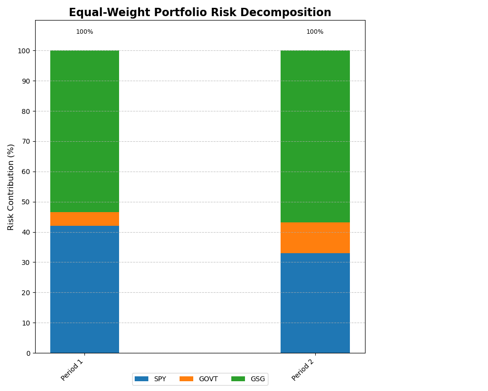
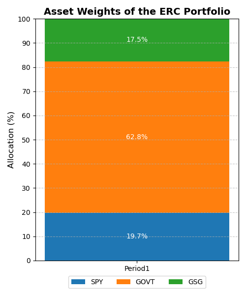
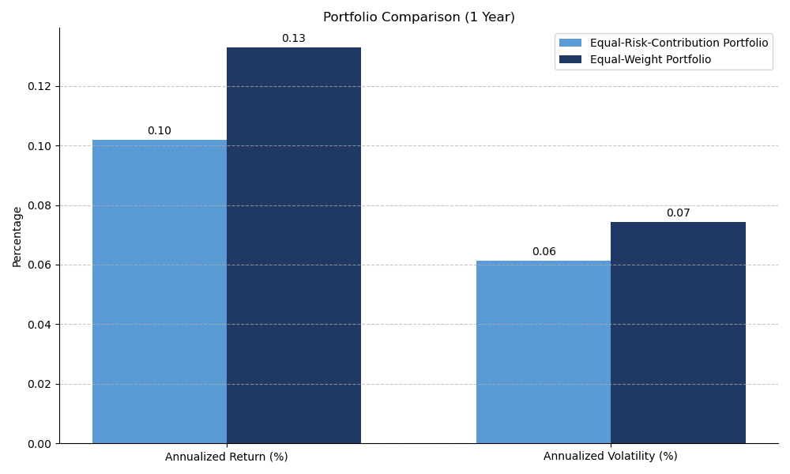

# Fintech-Intro

## Project Outline

```
.
├── data
│   ├── portfolio_value_period1.csv     # Portfolio values (3 assets) in Period1
│   ├── portfolio_value_period1_new.csv # Portfolio values (4 assets) in Period1 period
│   ├── portfolio_value_period2.csv     # Portfolio values (3 assets) in Period2
│   ├── portfolio_value_period2_new.csv # Portfolio values (4 assets) in Period2
│   └── stock_prices_p2.csv             # Extracted stock prices from original table 
├── fintech.yaml                     # Environment dependencies
├── main.py                          # Main script that runs the program
├── optimize                         # Directory for portfolio optimization algorithms
│   └── **erc.py**                       # Program implementing the Equal Risk Contribution (ERC)
└── portfolio_analysis
    ├── __init__.py
    ├── **asset.py**                     # Aseet class
    ├── period.py                    # Period class
    ├── **portfolio.py**                 # Portfolio class
    └── utils.py                     # Some utility functions
```

This project focuses on portfolio analysis and optimization, aiming to evaluate and enhance the performance of multi-asset portfolios across different time periods. It involves analyzing portfolio value data for various assets and periods, as well as implementing advanced portfolio optimization techniques such as Equal Risk Contribution (ERC). Period 1 spans from June 30, 2022, to June 30, 2023, while Period 2 covers June 30, 2023, to June 28, 2024. Through the integration of asset and portfolio classes, the project allows for flexible modeling of financial portfolios and provides tools for evaluating asset performance, optimizing portfolio allocations, and comparing results over time. The project is structured to support modular development, making it straightforward to extend with additional analysis techniques or optimization algorithms in the future.
## How to Run

Please refer to `fintech.yaml` for environment dependencies. Run the project using the following command:

```bash
python main.py
```

## Equal-Weight Portfolio (3 assets)

The portfolio’s value on each day can be found in **portfolio_value_period1.csv** and **portfolio_value_period2.csv**. The risk contribution chart is shown below:



## Equal-Risk-Contribution Portfolio (3 assets)

The chart of the asset weights of the ERC portfolio in Period 1 is shown below:



## Comparison (3 assets)

 The comparison between the equal-risk-contribution portfolio and the equal-weight portfolio is shown below:



The calculated data somewhat contradict the comment in research report, as the equal-weight portfolio outperforms the equal-risk-contribution portfolio in both absolute returns (0.1328 vs. 0.1018) and return/risk ratio (1.7898 vs. 1.6613). This discrepancy may be due, on one hand, to possible outliers or deviations from typical statistical patterns, and on the other hand, to more complex market conditions during that period, which might have impacted the performance of the equal-risk-contribution portfolio. Thus, the expected advantages of the equal-risk-contribution approach are not fully reflected in this case.

## Introducing Bitcoin as a separate asset class (4 assets)

 The equal-risk-contribution portfolio (with GBTC) offers the highest return/risk ratio, indicating better risk-adjusted performance. However, it comes with higher risk compared to the other portfolios.
